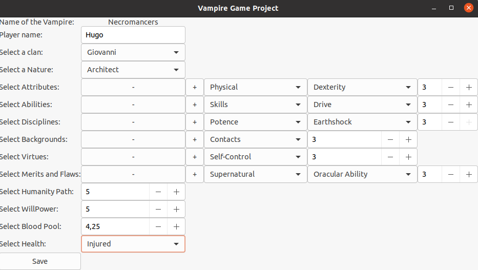

## Contents


[Launching the app](#launching-the-app)\
[Using the application](#using-the-application)\
[Bugs reported](#bugs-reported)\
[Developper guide](#developper-guide)


<br>

## Launching the app

To launch the application, you need to move on the folder containing the app with the **command-line**.\

Once you are in the folder, you can launch the application with the command:\

```{bash}
./vampireGameproject
```


## Using the application


Firstly, you need to enter a player name. After that, you can select a **Clan Name**. While you have not selected a **Clan name**, **Disciplines** remain locked. Once you have selected a **Clan name**, the **NickName** of your vampire appears at the top of the interface.


You can add a new line by clicking on the plus button and deleting a line by clicking on the minus button.


The next step consists to set an **Attributes name**, for each lines, you couldn't set points if you didn't choice the category in the First ComboBoxText Widget.   

Once you have filled all the items of the interface, you can submit your choices by clicking on the **Save** button.



After submitting your choices, you are invited to enter a filename to save your choices in a text file. After validation, the textfile is created with all your choices inside it.


## Bugs reported

Some bugs can be encountered by using the application.

**Don't press minus button after choosing a categoriy in a First ComboBoxText Widget if there is only one line set in a specific field.**

**Don't choose the same category for a FirstComboBoxText Widget belonging to a specific field more than two times**


## Developper guide

A Developper guide is available [here](Documentation/READMEDev.md).